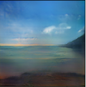
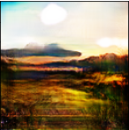

# Deep Convolutional Generative Adversarial Network for landscape generation

## ABOUT
The aim of this project is to generate realistic and plausible landscapes using one of the most popular GAN architecture - DCGAN based on the paper: https://arxiv.org/pdf/1511.06434.pdf.
#### Note: current version of the project is not yet finished and contains only "stage one" part of the network, and as for now it only generates low (128x128 pixels) resolution pictures due to RAM and GPU limitations.Final version shall include additional network allowing the GAN to generate more plausible pictures with higher resolution (ultimately 512x512 pixels)

## Dataset
Dataset used in the app can be found here: https://www.kaggle.com/arnaud58/landscape-pictures.

## Demonstrative photos generated by the current version of the network

